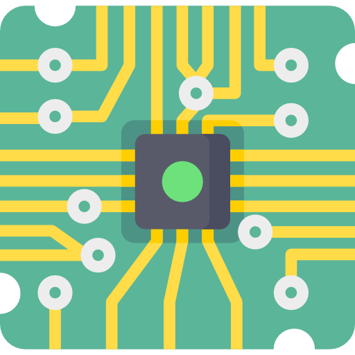

#  Tiramisu

1. [ Tiramisu](#-tiramisu)
   1. [Introduction](#introduction)
   2. [Structure](#structure)

## Introduction

This is Tiramisu (**T**oy **I**mplementation of **R**ISC-V **A**rchitecture **Mi**cro **P**rocessing **U**nit), a five-stage pipeline RISC-V CPU supporting base instructions of RV32I.

## Structure

See [the structure file](doc/structure.drawio)

